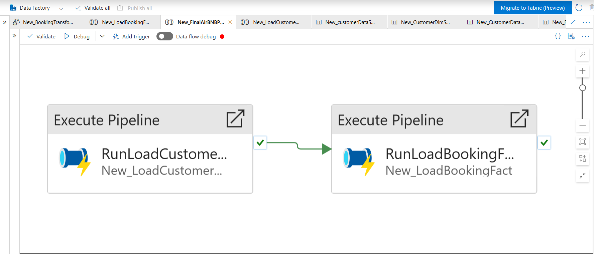
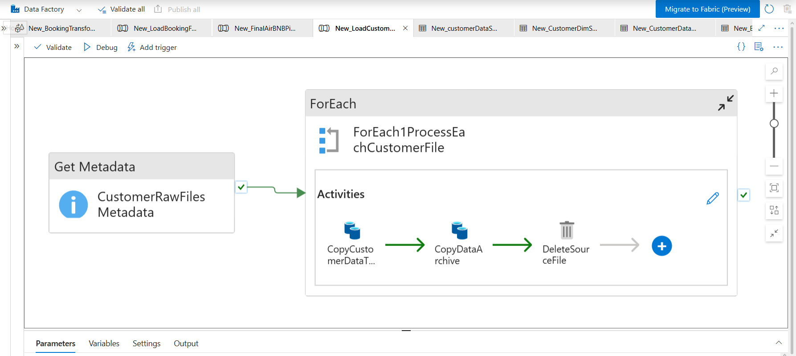
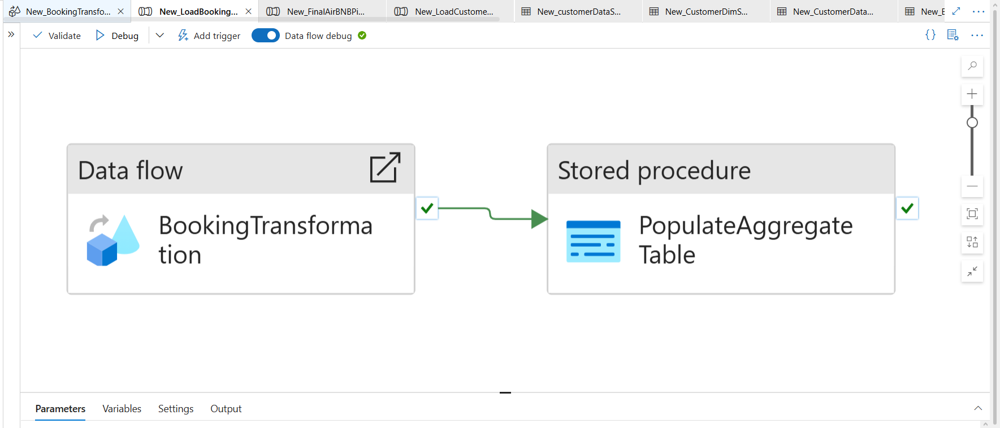
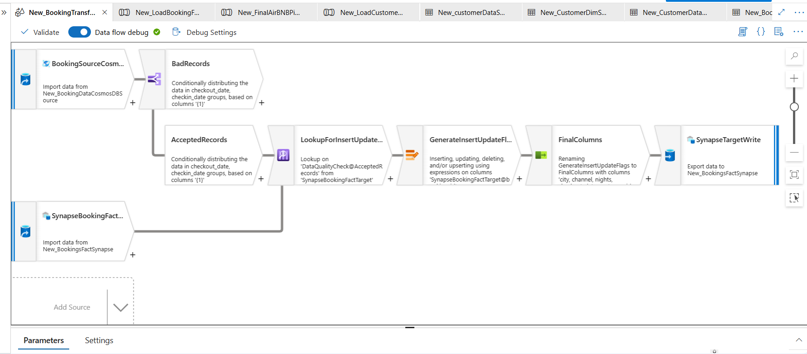
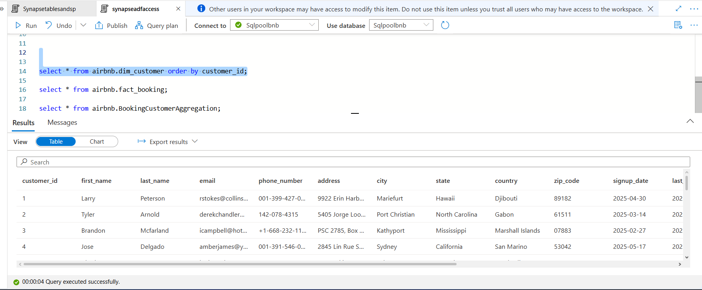
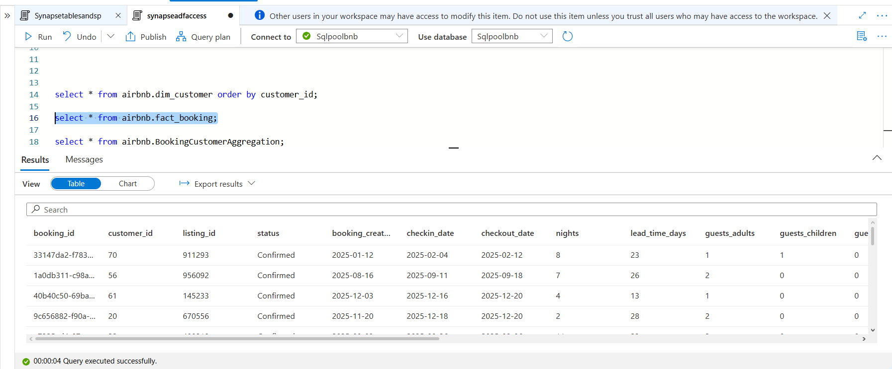
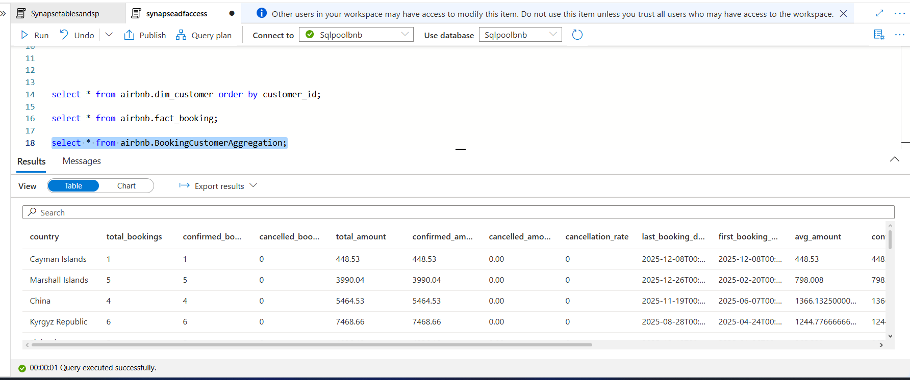
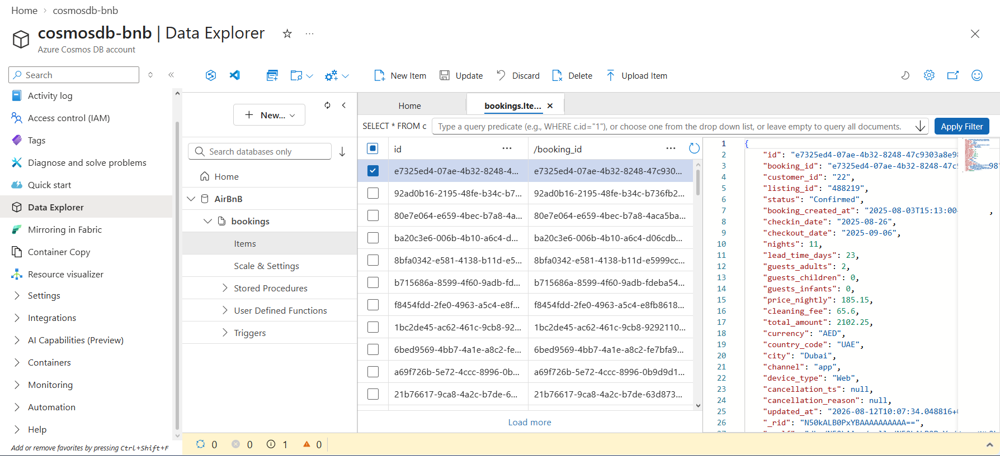
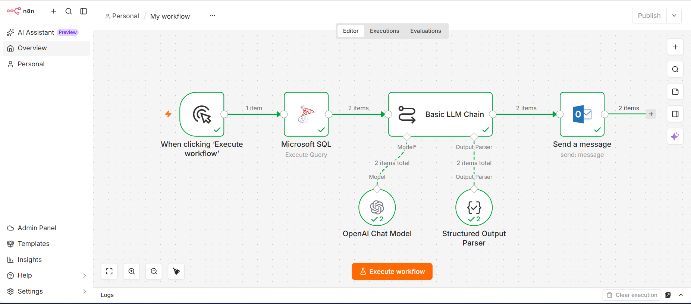
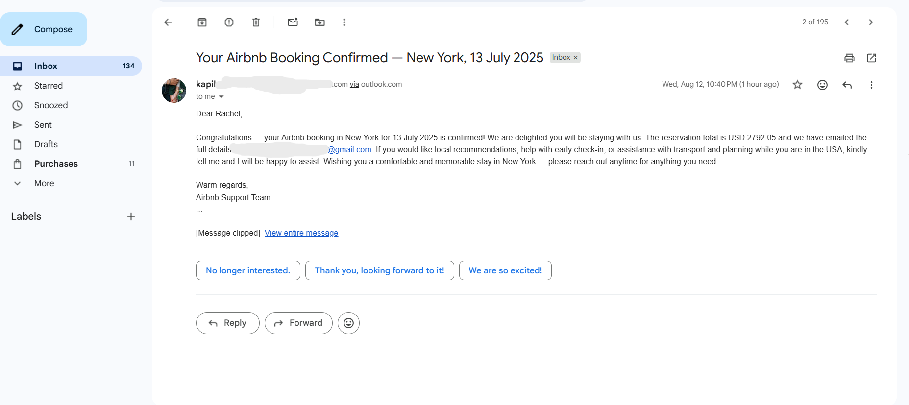

# 🏠 Airbnb CDC Data Pipeline & AI-Powered Analytics on Azure

An end-to-end data engineering and AI automation project built using **Azure Data Factory, Azure Data Lake Storage Gen2, Azure Cosmos DB, Azure Synapse Analytics, n8n, and OpenAI**.

The solution demonstrates **customer dimension processing, Cosmos DB Change Feed-based CDC ingestion, data-quality validation, insert/update processing, dimensional analytics, pipeline orchestration, and AI-powered personalized email automation**.

---

## 📌 Project Overview

This project implements an Airbnb-inspired booking data platform that integrates customer and booking data from different sources into an analytical data warehouse on Azure Synapse Analytics.

The solution consists of two primary ingestion paths:

- **Customer Data Pipeline:** Ingests customer files from ADLS Gen2 and performs an SCD Type-1-style upsert into the customer dimension.
- **Booking CDC Pipeline:** Consumes booking events from the Cosmos DB Change Feed, validates and transforms the events using an ADF Mapping Data Flow, and loads them into the booking fact table.

The processed data is then aggregated in Synapse and consumed by an **n8n + OpenAI workflow** to generate personalized customer communication automatically through Microsoft Outlook.

---

## 🏗️ Solution Architecture

<p align="center">
  
</p>

### High-Level Data Flow

```text
                    ┌──────────────────────┐
                    │      ADLS Gen2       │
                    │   Customer Raw Data  │
                    └──────────┬───────────┘
                               │
                               ▼
                    ┌──────────────────────┐
                    │   Azure Data Factory │
                    │ Customer Ingestion   │
                    └──────────┬───────────┘
                               │
                         SCD Type 1
                           Upsert
                               │
                               ▼
                    ┌──────────────────────┐
                    │ Azure Synapse        │
                    │   dim_customer       │
                    └──────────────────────┘


                    ┌──────────────────────┐
                    │   Azure Cosmos DB   │
                    │    Booking Events   │
                    └──────────┬───────────┘
                               │
                         Change Feed / CDC
                               │
                               ▼
                    ┌──────────────────────┐
                    │   Azure Data Factory │
                    │   Booking Pipeline   │
                    └──────────┬───────────┘
                               │
                               ▼
                    ┌──────────────────────┐
                    │  Mapping Data Flow   │
                    │                      │
                    │ • Data Quality       │
                    │ • Lookup             │
                    │ • Insert / Update    │
                    │ • Column Mapping     │
                    └──────────┬───────────┘
                               │
                               ▼
                    ┌──────────────────────┐
                    │ Azure Synapse        │
                    │    fact_booking      │
                    └──────────┬───────────┘
                               │
                               ▼
                    ┌──────────────────────┐
                    │ Booking Aggregation  │
                    └──────────┬───────────┘
                               │
                               ▼
                    ┌──────────────────────┐
                    │         n8n          │
                    │    AI Automation     │
                    └──────────┬───────────┘
                               │
                               ▼
                    ┌──────────────────────┐
                    │   OpenAI Chat Model  │
                    └──────────┬───────────┘
                               │
                               ▼
                    ┌──────────────────────┐
                    │ Microsoft Outlook    │
                    │ Personalized Email   │
                    └──────────────────────┘
```

## 🛠️ Technology Stack

| Technology | Purpose |
|---|---|
| **Azure Data Lake Storage Gen2** | Customer raw-file storage and archival |
| **Azure Data Factory** | Data ingestion, pipeline orchestration and transformation |
| **ADF Mapping Data Flow** | Booking transformation, validation and insert/update processing |
| **Azure Cosmos DB for NoSQL** | Booking event source |
| **Cosmos DB Change Feed** | Incremental CDC event ingestion |
| **Azure Synapse Analytics** | Analytical warehouse and dimensional data model |
| **SQL** | Aggregation logic and stored procedures |
| **n8n** | AI workflow orchestration |
| **OpenAI** | Personalized email generation |
| **Microsoft Outlook** | Automated email delivery |

---

## 🎯 Business Problem

An Airbnb-style booking platform generates customer and booking information from multiple operational sources.

The data engineering solution needs to:

1. Ingest customer information from cloud storage.
2. Keep the customer dimension up to date.
3. Capture incremental booking changes using CDC.
4. Validate incoming booking events.
5. Insert new bookings and update existing bookings.
6. Maintain analytical tables in Azure Synapse Analytics.
7. Generate business-level booking aggregations.
8. Use processed data to automate personalized customer communication.

---

## 🔄 Customer Data Pipeline

Customer data is stored in **Azure Data Lake Storage Gen2 (ADLS Gen2)** and processed through Azure Data Factory.

### Storage Structure

```text
ADLS Gen2
└── airbnb
    ├── customer-raw-data
    └── customer-data-archive
Get Metadata
      ↓
ForEach Customer File
      ↓
Copy Customer Data
      ↓
Synapse dim_customer
      ↓
Archive Processed File
      ↓
Delete Source File
```
---

## 🔁 Booking CDC Pipeline

Booking events are stored in **Azure Cosmos DB for NoSQL**.

### Cosmos DB Source

```text
Azure Cosmos DB
└── Container: bookings
```
Cosmos DB Change Feed

---

## 🔍 Booking Transformation & Data Quality

The **`New_BookingTransformation`** Mapping Data Flow processes incremental booking events received from the Cosmos DB Change Feed.

### Transformation Flow

```text
Cosmos DB Change Feed
          ↓
Data Quality Check
          ↓
Accepted Records
          ↓
Lookup Existing booking_id
          ↓
Generate Insert / Update Flags
          ↓
Final Column Mapping
          ↓
Synapse fact_booking
          ↓
New_BookingTransformation
          ↓
BookingAggregation Stored Procedure
          ↓
Synapse fact_booking
```

---

## 🏢 Synapse Data Model

The analytical layer is implemented in **Azure Synapse Analytics** using the `airbnb` schema.

### Customer Dimension

**Table:** `airbnb.dim_customer`

The customer dimension contains attributes such as:

- `customer_id`
- `first_name`
- `last_name`
- `email`
- `phone_number`
- `address`
- `city`
- `state`
- `country`
- `zip_code`
- `signup_date`
- `last_login`
- `total_bookings`
- `total_spent`
- `preferred_language`
- `referral_code`
- `account_status`

### Booking Fact

**Table:** `airbnb.fact_booking`

The booking fact table contains attributes such as:

- `booking_id`
- `customer_id`
- `listing_id`
- `status`
- `booking_created_at`
- `checkin_date`
- `checkout_date`
- `nights`
- `lead_time_days`
- `guests_adults`
- `guests_children`
- `guests_infants`
- `price_nightly`
- `cleaning_fee`
- `total_amount`
- `currency`
- `country_code`
- `city`
- `channel`
- `device_type`
- `cancellation_ts`
- `cancellation_reason`
- `updated_at`


---

## 📊 Booking Aggregation

After successful booking transformation and loading, the pipeline executes a Synapse stored procedure:

**Stored Procedure:** `airbnb.BookingAggregation`

This procedure generates business-level booking metrics from the processed booking data.

### Aggregation Flow

```text
airbnb.fact_booking
        ↓
BookingAggregation
        ↓
Business-Level Booking Metrics
```
---

## 🔗 Master Pipeline Orchestration

The solution uses a master Azure Data Factory pipeline to coordinate the complete data ingestion workflow.

**Master Pipeline:** `New_FinalAirBNBPipeline`

The master pipeline executes the customer and booking pipelines in a controlled sequence.

### Orchestration Flow

```text
New_FinalAirBNBPipeline
          │
          ▼
New_LoadCustomerDim
          │
      Succeeded
          │
          ▼
New_LoadBookingFact
```
---

## 🤖 AI-Powered Customer Communication

The project extends the Azure data platform with an AI-powered automation workflow using **n8n and OpenAI**.

The workflow retrieves processed business insights from Synapse and uses the contextual information to generate personalized email communication.

### AI Automation Flow

```text
Azure Synapse Analytics
          ↓
Processed Business Insights
          ↓
n8n Workflow
          ↓
OpenAI Chat Model
          ↓
Personalized Email Content
          ↓
Microsoft Outlook
```
---

## 📸 Project Screenshots

The following screenshots demonstrate the key components implemented in the project.

### Master ADF Pipeline

<p align="center">
  
</p>

### Customer Ingestion Pipeline

<p align="center">
  
</p>

### Booking CDC Pipeline

<p align="center">
  
</p>

### Booking Transformation Data Flow

<p align="center">
  
</p>

### Synapse Customer Dimension

<p align="center">
  
</p>

### Synapse Booking Fact

<p align="center">
  
</p>

### Booking Aggregation

<p align="center">
  
</p>

### Cosmos DB Booking Container

<p align="center">
  
</p>

### n8n AI Automation

<p align="center">
  
</p>

### AI-Generated Email

<p align="center">
  
</p>
